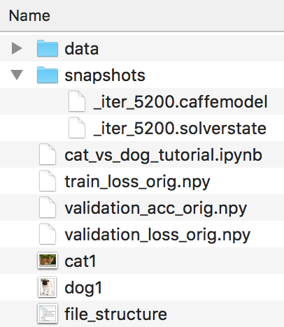

# cat-vs-dog-caffe
Tutorial to build a cat vs dog classifier using Caffe with Python

This is a tutorial to build a cat vs dog classifier in Caffe using purely Python, utilizing the CaffeNet architecture. The aim of this tutorial is to create your own convolutional neural network, starting with nothing but the data (images) you'd like to classify. You'll need to have caffe and openCV installed to run this tutorial.

There are 6 main steps outlined in this tutorial:
1. Image Preprocessing and Database Creation 
2. Generating the Mean Image  
3. Defining the Training, Validation, and Deployment Network Architectures  
4. Create the Solver  
5. Train the Net  
6. Test the Net on New Data 

Everything is contained in a single, executable notebook file. Several support files are necessary to run the notebook file...download links are provided in step 0 of the tutorial (Data Prep). If you've set everything up correctly, your file structure will look like this:  

By the end of this tutorial, you'll be able to develop a cat vs dog classifier with about 90% accuracy (or higher, if you choose to continue training):

